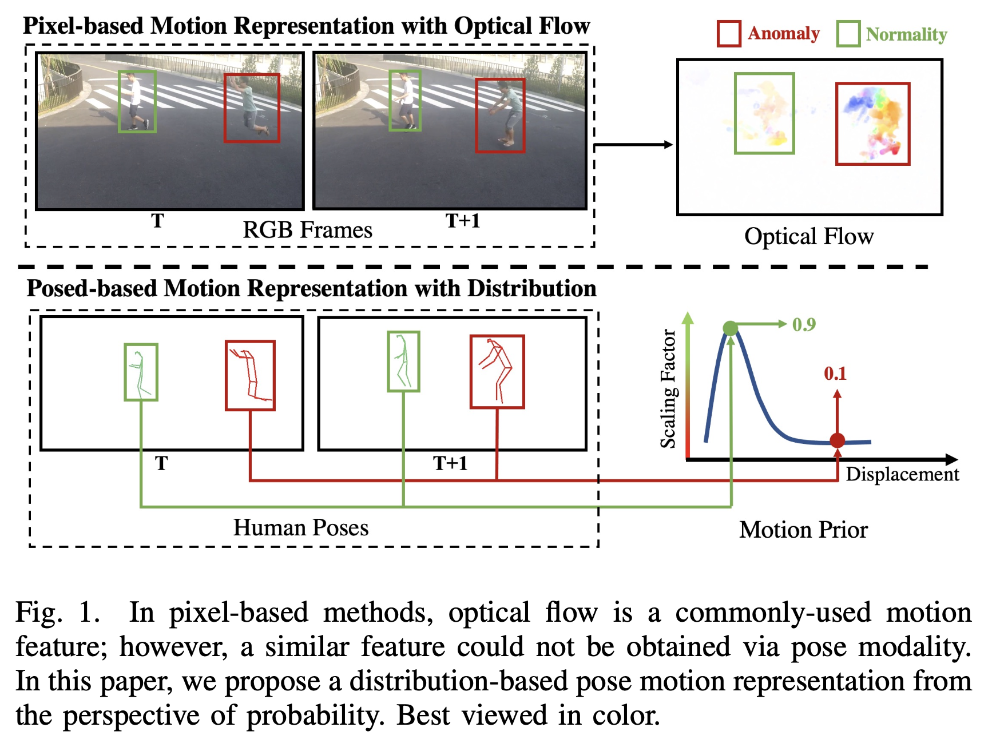

# 💻 Code for Regularity Learning via Explicit Distribution Modeling for Skeletal Video Anomaly Detection

* Authors: [Shoubin Yu](https://yui010206.github.io/), [Zhongyin Zhao](https://github.com/ZZhongYin), 
[Hao-shu Fang](https://fang-haoshu.github.io/), [Andong Deng](https://dengandong.github.io/)
[Haisheng Su](https://scholar.google.com.hk/citations?user=OFrMZh8AAAAJ&hl=zh-CN), [Dongliang Wang](https://scholar.google.com.hk/citations?hl=zh-CN&user=gurERzcAAAAJ)
[Weihao Gan](https://scholar.google.com.hk/citations?hl=zh-CN&user=QIC0rCYAAAAJ), [Cewu Lu](https://www.mvig.org/), and [Wei Wu](https://scholar.google.com/citations?user=9RBxtd8AAAAJ&hl=en&oi=ao)

* [Paper](https://ieeexplore.ieee.org/abstract/document/10185076) ([IEEE Transactions on Circuits and Systems for Video Technology 2023](https://ieeexplore.ieee.org/xpl/RecentIssue.jsp?punumber=76))




## Data Preparetion

  We extract poses in ShanghaiTech following the same way as [GEPC](https://github.com/amirmk89/gepc). As for Corridor, we adopt the same methods mentioned in [here](https://rodrigues-royston.github.io/Multi-timescale_Trajectory_Prediction/). Once poses have been downloaded or extracted, change the data path in ***src/datasets/dataset_path.py*** to train or test models.

## Train model
For ShanghaiTech

``` python train_test.py --exp_name ShanghaiTech_AlphaPose_train --dataset ShanghaiTech_AlphaPose```

For Corridor

``` python train_test.py --exp_name Corridor_train --dataset Corridor```

## Test model
For ShanghaiTech

``` python train_test.py --exp_name ShanghaiTech_AlphaPose_test --dataset ShanghaiTech_AlphaPose --inference True --model_path your_path_to_model ```

For Corridor

``` python train_test.py --exp_name Corridor_test --dataset Corridor --inference True --model_path your_path_to_model ```